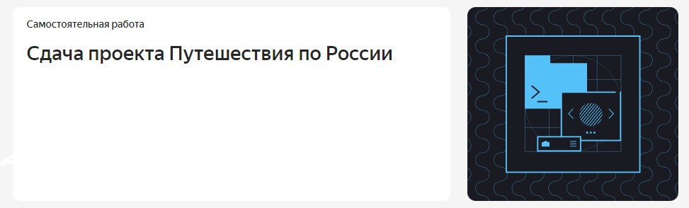
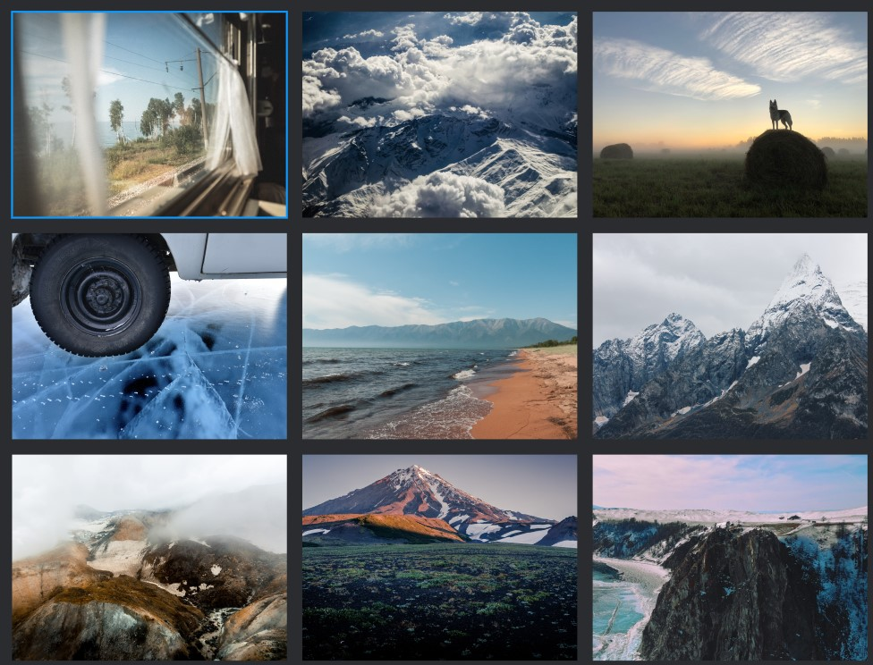
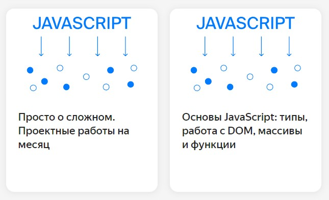

# Проект: Путешествие по России

------
Вторая проектная работа курса **Веб-разработчик-плюс**

## Обзор
* Интро
* Figma
* Картинки
* Применяемые технологии
* Адрес проекта
* Планы на будущее

### **Интро**

Проект с применением адаптивной и "резиновой" вёрстки, для создания гибкого одностраничника, который должен отображаться на самых распространённых разрешениях экранов согласно макету.

### **Figma**

* [Ссылка на макет в Figma](https://www.figma.com/file/5S2WSbEFL6awjVWJ0NWL8Q/Sprint-3_-Russia-_-desktop-mobile?node-id=28503%3A0)

### **Картинки**

Картинки оптимизированы при помощи [ресурса](https://tinypng.com/), с использованием которого сайт будет загружаться быстрее.

### **Применяемые технологии**
* Grid
* Media
* БЭМ
* Адаптивная вёрстка
* Сглаживание шрифтов
* Оптимизация картинок

### **Адрес проекта**

Проект расположен на [GitHub](https://si3el.github.io/russian-travel/index.html)

### **Планы**

Сделать сайт более интерактивным при помощи технологий JavaScript

